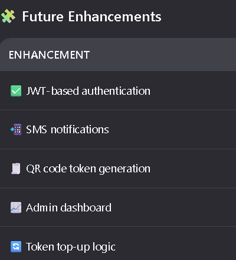

# 🌐 Electricity Generating Prepaid Tokens System

## 🧾 Project Description
This application provides a full electricity prepaid token generation and management system , allowing users to:

🔐 Register and log in securely
💰 Purchase electricity tokens by entering amount and meter number
📋 Generate 16-digit tokens with valid days of usage
🚨 Receive email notifications before token expiry
🔍 Validate tokens via RESTful API
All APIs are documented using Swagger UI , making it easy to test and integrate into mobile/web apps.

# 🛠 Key Features
## User Registration & Login
Users can create account and authenticate using HTTP Basic Auth
🔁 Password Reset
Forgot password flow with token sent to user’s email
🪙 Token Generation
16-digit unique token generated per purchase
⏳ Token Validity Policy
100 RwF = 1 day of electricity
📦 Meter Number Management
Admins can assign unique meter numbers to users
📬 Email Notifications
Users receive emails if token will expire within 5 hours
🧾 Swagger Documentation
All endpoints documented via OpenAPI

## 🧱 Technologies Used
Backend: Java (Spring Boot 3.x)
Database: PostgreSQL 
Security: Spring Security + BCryptPasswordEncoder
Email Service: JavaMailSender (Gmail SMTP)
REST APIs: Swagger UI + OpenAPI
Frontend Integration Ready: Works with React Native, React.js, Android, etc.
🧪 API Endpoints
🔑 Authentication
POST /api/register – Register new user
POST /api/login – Log in existing user
🪙 Token Purchase
POST /api/tokens/purchase – Buy token using meter number and amount
GET /api/tokens/history/{meterNumber} – View token history
GET /api/tokens/validate?token=... – Validate token
📦 Meter Numbers
POST /api/meters/assign/{userId} – Assign meter number to user (Admin only)
GET /api/meters/user/{meterNumber} – Get all tokens assigned to meter
📩 Notifications
GET /api/notifications/user/{meterNumber} – Get token expiration warnings
GET /api/notifications/check-expiry – Manually trigger notification check
📄 Swagger Documentation
All APIs are documented using Swagger UI . After running the app, go to:

👉 http://localhost:8080/swagger-ui/index.html

You’ll see:

Full descriptions of each endpoint
Request/response examples
Interactive test forms
📦 Database Schema
Tables:
users: Stores user data (email, password, name, role)
meter_numbers: Unique meter numbers linked to users
purchased_tokens: Generated tokens, linked to meter numbers
notifications: Expiry messages sent to users
📨 Email Configuration
The system uses Gmail SMTP to send token expiry reminders.

🔐 Security
Uses Spring Security with:
Public access to /register, /login
Role-based access (ADMIN for meter assignment)
JWT support ready to be added
Method-level security using @PreAuthorize("hasRole('ADMIN')")
🧪 Running the Application
Prerequisites:
Java 17+
Maven
PostgreSQL 
Steps:
Clone the repo:
bash

1
git clone https://github.com/KIRENGA-Remy/electricity_generating_prepaid_tokens.git
Navigate to the project folder:
bash

1
cd electricity-generating-prepaid-tokens
Build the project:

1
mvn clean install
Start the app:

1
mvn spring-boot:run
Open in browser:

Swagger UI: http://localhost:8080/swagger-ui/index.html
H2 Console (if enabled): http://localhost:8080/h2-console
🧩 Future Enhancements

🤝 Contributing
Contributions are welcome! If you'd like to improve this system, please read our contribution guidelines.

📜 License
MIT License – see LICENSE for details.

📞 Contact
Remy Claudien GITOLI
📧 Email: gitoliremy@gmail.com

🎯 Built For
Java Exam Project
National Examination Center – Rwanda
Subject: Backend Development for Electricity Prepaid Token System

Happy coding! ❤️